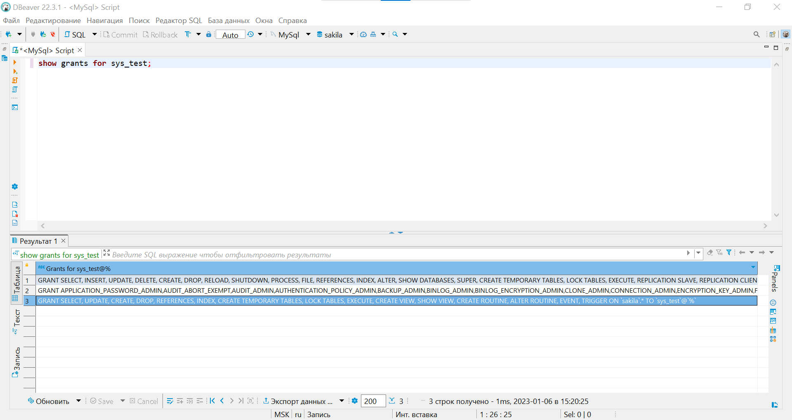

# Домашнее задание к занятию 12.2. «Работа с данными (DDL/DML)» - Громченко Иван

Задание можно выполнить как в любом IDE, так и в командной строке.

### Задание 1
1.1. Поднимите чистый инстанс MySQL версии 8.0+. Можно использовать локальный сервер или контейнер Docker.

1.2. Создайте учётную запись sys_temp. 

1.3. Выполните запрос на получение списка пользователей в базе данных. (скриншот)


1.4. Дайте все права для пользователя sys_temp. 

1.5. Выполните запрос на получение списка прав для пользователя sys_temp. (скриншот)


1.6. Переподключитесь к базе данных от имени sys_temp.

Для смены типа аутентификации с sha2 используйте запрос: 
```sql
ALTER USER 'sys_test'@'localhost' IDENTIFIED WITH mysql_native_password BY 'password';
```
1.6. По ссылке https://downloads.mysql.com/docs/sakila-db.zip скачайте дамп базы данных.

1.7. Восстановите дамп в базу данных.

1.8. При работе в IDE сформируйте ER-диаграмму получившейся базы данных. При работе в командной строке используйте команду для получения всех таблиц базы данных. (скриншот)


*Результатом работы должны быть скриншоты обозначенных заданий, а также простыня со всеми запросами.*
```sql
CREATE USER 'sys_test'@'%' IDENTIFIED BY 'test_pw';
SELECT user FROM mysql.user;
GRANT ALL PRIVILEGES ON *.* TO 'sys_test'@'%';
SHOW grants FOR sys_test;
ALTER USER 'sys_test'@'%' IDENTIFIED WITH mysql_native_password BY 'test_pw';
```

---

### Задание 2
Составьте таблицу, используя любой текстовый редактор или Excel, в которой должно быть два столбца: в первом должны быть названия таблиц восстановленной базы, во втором названия первичных ключей этих таблиц. Пример: (скриншот/текст)
```
Название таблицы | Название первичного ключа
customer         | customer_id
```

**Запрошенную таблицу вернёт следующий SQL-запрос:**
```sql
SELECT TABLE_NAME, COLUMN_NAME FROM INFORMATION_SCHEMA.COLUMNS WHERE TABLE_SCHEMA = 'sakila' AND COLUMN_KEY = 'PRI';
```

---

### Задание 3*
3.1. Уберите у пользователя sys_temp права на внесение, изменение и удаление данных из базы sakila.

3.2. Выполните запрос на получение списка прав для пользователя sys_temp. (скриншот)



*Результатом работы должны быть скриншоты обозначенных заданий, а также простыня со всеми запросами.*
```sql
REVOKE insert, alter, delete PRIVILEGES ON sakila.* FROM 'sys_test'@'%';
SHOW grants FOR sys_test;
```

---