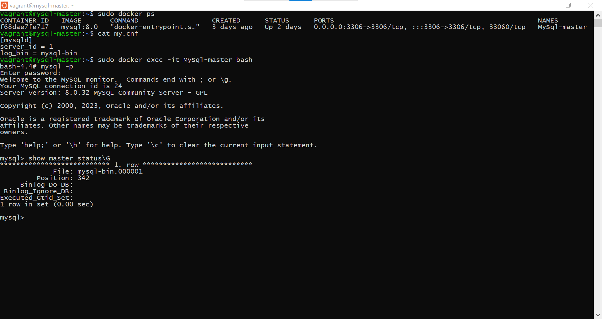
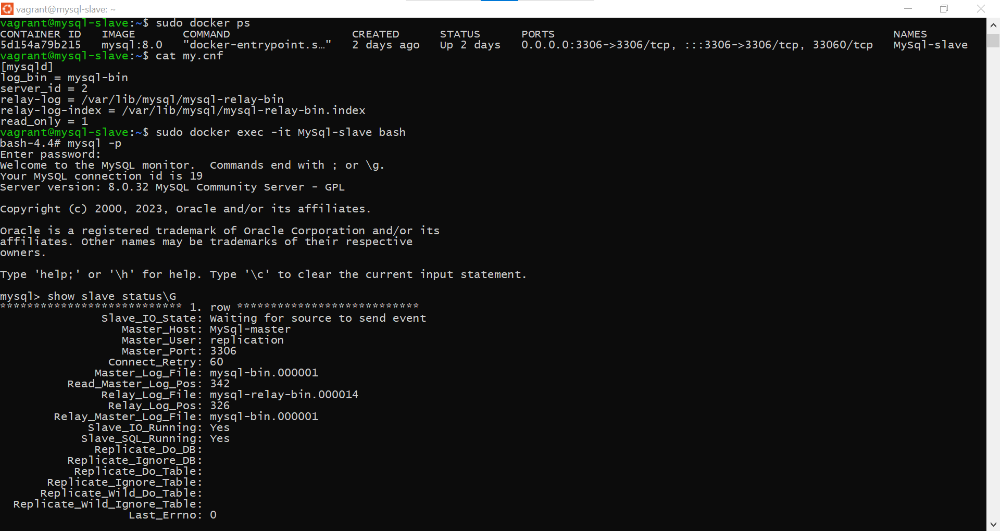
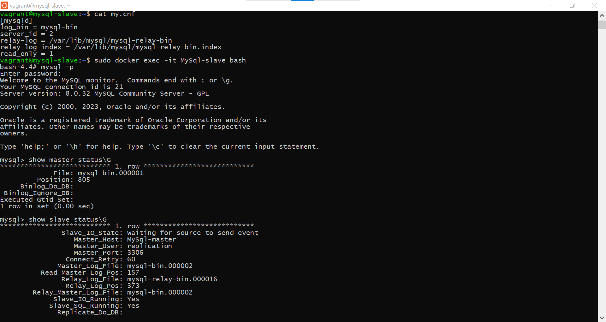

# Домашнее задание к занятию 12.6. «Репликация и масштабирование. Часть 1» - Громченко Иван

### Задание 1

На лекции рассматривались режимы репликации master-slave, master-master, опишите их различия.

*Ответить в свободной форме.*

**Различие заключается в том, что при репликации master-slave реплика доступна только для чтения и следует за мастером.
А в случае репликации master-master оба сервера доступны как для чтения, так и для записи, но при этом возникает возможность возникновения состояния split-brain.**

---

### Задание 2

Выполните конфигурацию master-slave репликации, примером можно пользоваться из лекции.

*Приложите скриншоты конфигурации, выполнения работы: состояния и режимы работы серверов.*

---

### Задание 3* 

Выполните конфигурацию master-master репликации. Произведите проверку.

*Приложите скриншоты конфигурации, выполнения работы: состояния и режимы работы серверов.*

---