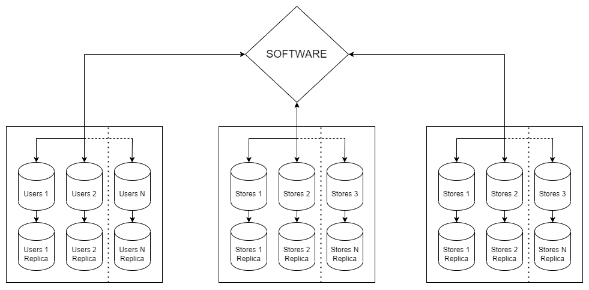

# Домашнее задание к занятию 12.7. «Репликация и масштабирование. Часть 2» - Громченко Иван

### Задание 1

Опишите основные преимущества использования масштабирования методами:

- активный master-сервер и пассивный репликационный slave-сервер; **- Повышает отказоустойчивости системы за счет наличия полной актуальной копии данных на backup сервере, а также увеличивает скорость чтения данных за счет направления обращений к реплике.** 
- master-сервер и несколько slave-серверов; **- Усиливает преимущества предыдущего решения. Синхронная копия может быть сразу назначена мастером с сохранением отказоустойчивости системы. Скорость чтения данных увеличивается пропорционально количеству реплик.**
- активный сервер со специальным механизмом репликации — distributed replicated block device (DRBD); **- Единственное преимущество данного метода заключается в том, что репликация производится на уровне ОС и, таким образом, отсутствуют какие-либо требования к СУБД, данные которой при этом реплицируются.**
- SAN-кластер. **- Усиливает преимущества предыдущего решения. Позволяет централизованно управлять ресурсами СХД, изменять количество реплик данных и масштабировать СХД без прерывания сервиса.**

*Дайте ответ в свободной форме.*

---

### Задание 2

Разработайте план для выполнения горизонтального и вертикального шардинга базы данных. База данных состоит из трёх таблиц: 

- пользователи,
- книги,
- магазины (столбцы произвольно).

Опишите принципы построения системы и их разграничение или разбивку между базами данных.

*Пришлите блоксхему, где и что будет располагаться. Опишите, в каких режимах будут работать сервера.*

**Для обеспечения максимальной горизонтальной масштабируемости базы данных будем её шардировать в обоих направлениях:**
1. Вертикальное шардирование - организуем каждую таблицу в отдельную БД, связь между данными будет организована по ключам на стороне приложения.
2. Горизонтальное шардирование - организуем построчное шардирование данных на N серверов по остатку от деления ключа на N.
3. Репликация - добавим одну синхронную реплику каждому шарду. В дальнейшем можно будет увеличить количество реплик при необходимости.

---

### Задание 3*

Выполните настройку выбранных методов шардинга из задания 2.

*Пришлите конфиг Docker и SQL скрипт с командами для базы данных*.

**Верю на слово, что это сложно и не надёжно!**

---