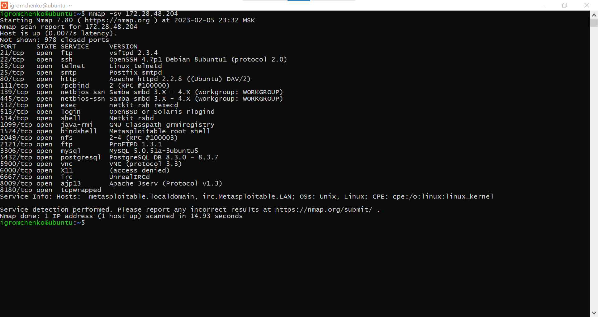

# Домашнее задание к занятию 13.1. «Уязвимости и атаки на информационные системы» - Громченко Иван

### Задание 1

Скачайте и установите виртуальную машину Metasploitable: https://sourceforge.net/projects/metasploitable/.

Это типовая ОС для экспериментов в области информационной безопасности, с которой следует начать при анализе уязвимостей.

Просканируйте эту виртуальную машину, используя **nmap**.

Попробуйте найти уязвимости, которым подвержена эта виртуальная машина.

Сами уязвимости можно поискать на сайте https://www.exploit-db.com/.

Для этого нужно в поиске ввести название сетевой службы, обнаруженной на атакуемой машине, и выбрать подходящие по версии уязвимости.

Ответьте на следующие вопросы:

- Какие сетевые службы в ней разрешены? **- Перечень работающих сетевых служб приведен на скриншоте вывода nmap ```-sV``` ниже**;
- Какие уязвимости были вами обнаружены? (список со ссылками: достаточно трёх уязвимостей)
  - Уязвимость FTP-сервера, позволяющая выполнять команды на хосте (https://www.exploit-db.com/exploits/49757)
  - Уязвимость SSH-сервера, позволяющая получить перечень пользователей (https://www.exploit-db.com/exploits/45233)
  - Уязвимость WEB-сервера, позволяющая произвести DoS-атаку (https://www.cve.org/CVERecord?id=CVE-2011-3192)
  
*Приведите ответ в свободной форме.*  



---

### Задание 2

Проведите сканирование Metasploitable в режимах SYN, FIN, Xmas, UDP.

Запишите сеансы сканирования в Wireshark.

Ответьте на следующие вопросы:

- Чем отличаются эти режимы сканирования с точки зрения сетевого трафика? **- В зависимости от установок сетевых экранов тестируемой системы, различные флаги позволяют сделать трафик более "незаметным", либо избежать отбрасывания пакетов или логирования попытки подключения:**
  - В режимах SYN и FIN запросы отправляются с соответствующими флагами в заголовках TCP-сегментов;
  - В режиме Xmas устанавливаются флаги FIN, PSH и URG, что делает запрос максимально "заметным" в сетевом трафике;
  - В режиме UDP, соответственно, запросы отправляются по протоколу UPD и некоторое время ожидаются ответы сервера.
- Как отвечает сервер?
  - На TCP-запросы с флагом SYN сервер отвечает сегментом SYN-ACK;
  - На TCP-запросы с некорректными флагами сервер отвечает сегментом RST или не отвечает вообще (в зависимости ОС, настроек сетевого экрана и т.п.);
  - На UDP-запросы сервер отправляет штатный ответ, если это не запрещено настройками сетевого экрана.

*Приведите ответ в свободной форме.*

---