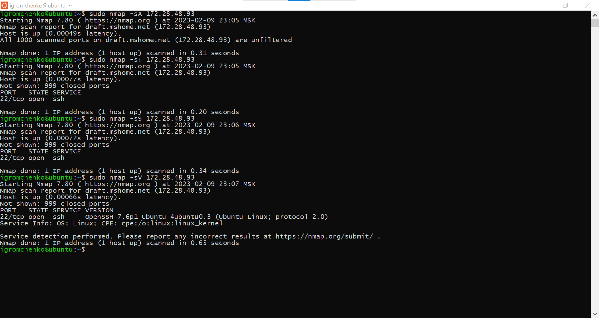
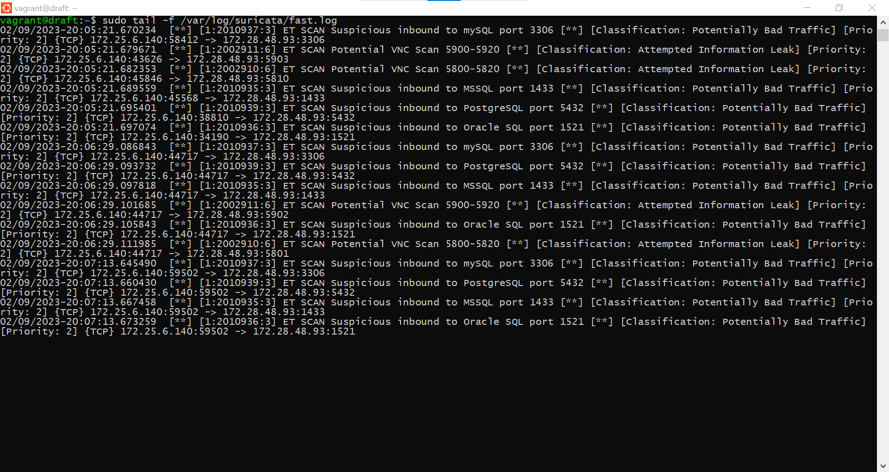
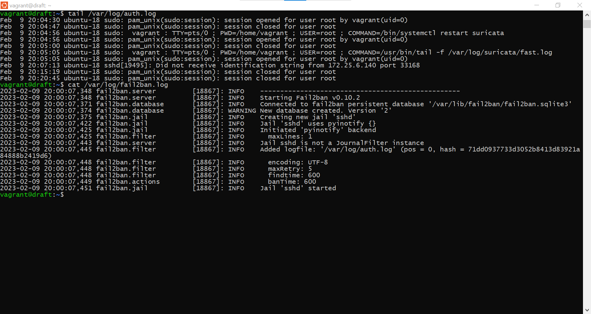
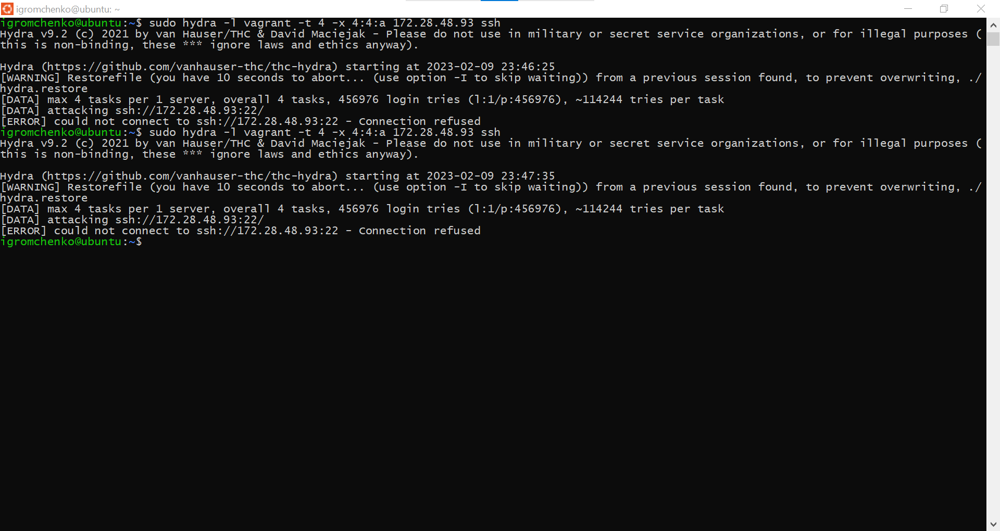
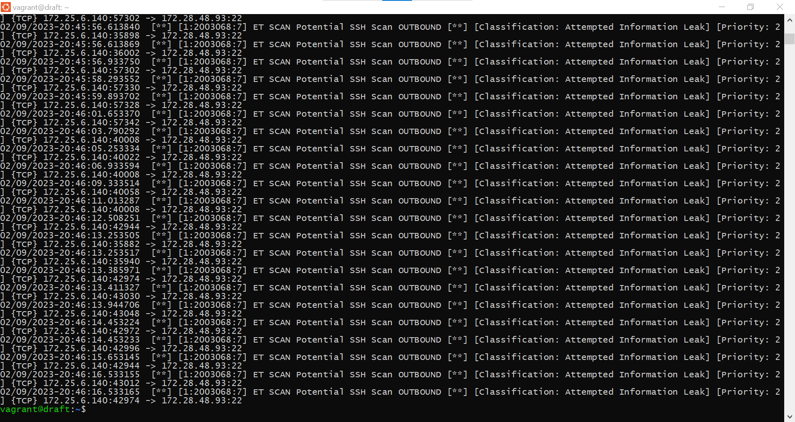
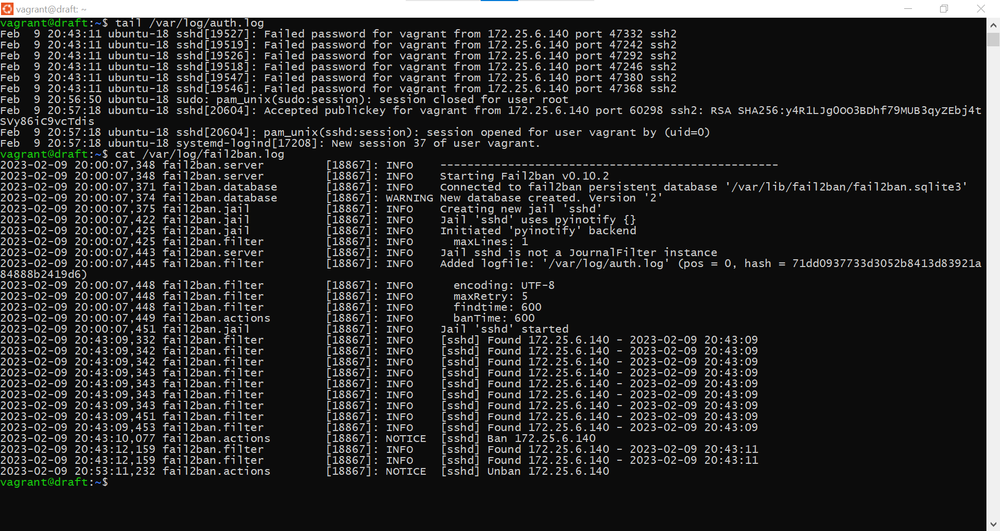

# Домашнее задание к занятию 13.3. «Защита сети» - Громченко Иван

### Подготовка к выполнению заданий

1. Подготовка защищаемой системы:

- установите **Suricata**,
- установите **Fail2Ban**.

2. Подготовка системы злоумышленника: установите **nmap** и **thc-hydra** либо скачайте и установите **Kali linux**.

Обе системы должны находится в одной подсети.

---

### Задание 1

Проведите разведку системы и определите, какие сетевые службы запущены на защищаемой системе:

**sudo nmap -sA < ip-адрес >**

**sudo nmap -sT < ip-адрес >**

**sudo nmap -sS < ip-адрес >**

**sudo nmap -sV < ip-адрес >**

По желанию можете поэкспериментировать с опциями: https://nmap.org/man/ru/man-briefoptions.html.

*В качестве ответа пришлите события, которые попали в логи Suricata и Fail2Ban, прокомментируйте результат.* **- Из логов Suricata видно, что эта IDS из коробки фиксирует подозрительные запросы на порты, используемые популярными СУБД - PostgreSQL, MySQL, MSSQL и Oracle. Fail2Ban, в свою очередь, ничего не зафиксировал, хотя даже в системном журнале авторизаций был зафиксирован подозрительный запрос на порт SSH.**

---

### Задание 2

Проведите атаку на подбор пароля для службы SSH:

**hydra -L users.txt -P pass.txt < ip-адрес > ssh**

1. Настройка **hydra**: 
 
 - создайте два файла: **users.txt** и **pass.txt**;
 - в каждой строчке первого файла должны быть имена пользователей, второго — пароли. В нашем случае это могут быть случайные строки, но ради эксперимента можете добавить имя и пароль существующего пользователя.

Дополнительная информация по **hydra**: https://kali.tools/?p=1847.

2. Включение защиты SSH для Fail2Ban:

-  открыть файл /etc/fail2ban/jail.conf,
-  найти секцию **ssh**,
-  установить **enabled**  в **true**.

Дополнительная информация по **Fail2Ban**:https://putty.org.ru/articles/fail2ban-ssh.html.

*В качестве ответа пришлите события, которые попали в логи Suricata и Fail2Ban, прокомментируйте результат.* **- Из логов Suricata видно, что эта IDS из коробки фиксирует попытку подбора пароля по SSH. Fail2Ban, в свою очередь, зафиксировав 10 неудачных попыток подключения, заблокировал атакующего на 10 минут - в системном журнале авторизаций также фиксируются неудачные запросы на порт SSH.**

---